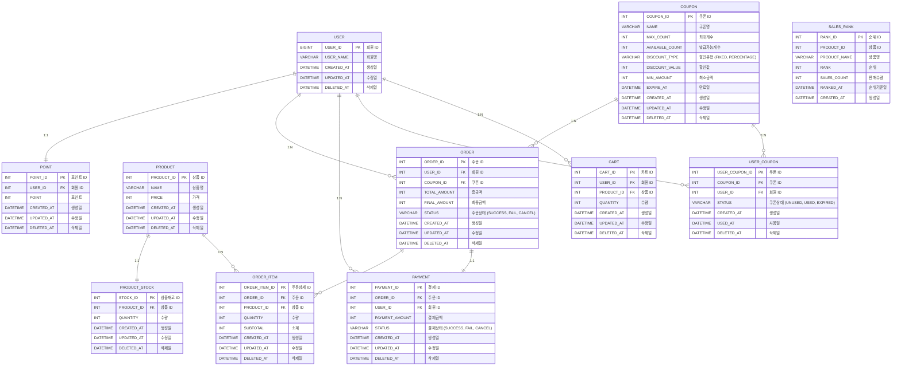

## ERD

### 데이터 목록

- **USER**:  회원
- **POINT**: 포인트
- **PRODUCT**: 상품
- **PRODUCT_STOCK**: 재고
- **ORDER**: 주문
- **ORDER_ITEM**: 주문 상세
- **PAYMENT**: 결제
- **COUPON**: 쿠폰
- **USER_COUPON**: 사용자 쿠폰
- **CART**: 장바구니
- **SALES_RANK**: 판매순위

### ERD

- 상품의 재고에 `lock` 을 걸어도 상품에는 영향이 가지 않도록 `PRODUCT` 테이블과 `PRODUCT_STOCK` 테이블을 분리한다.
- 주문에는 상태값이 존재하고 하나의 주문으로 해당 주문서에 포함된 주문 상품들이 관리되어야 하므로, `ORDER` 테이블과 `ORDER_ITEM` 테이블을 분리한다.
- 인기 상품 목록 조회 시, 조회 성능 최적화를 위해 `SALES_RANK` 테이블을 생성해 사전 집계 데이터를 저장한다.
