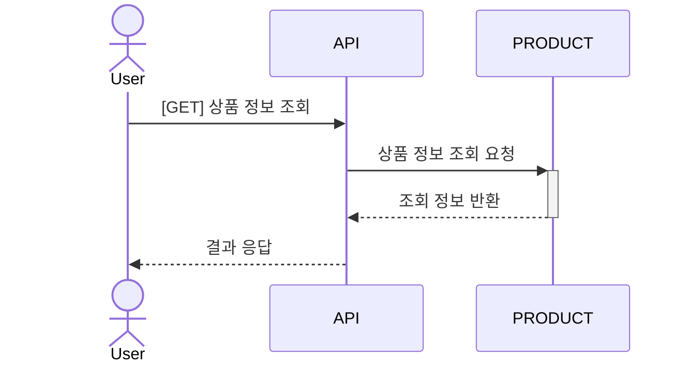
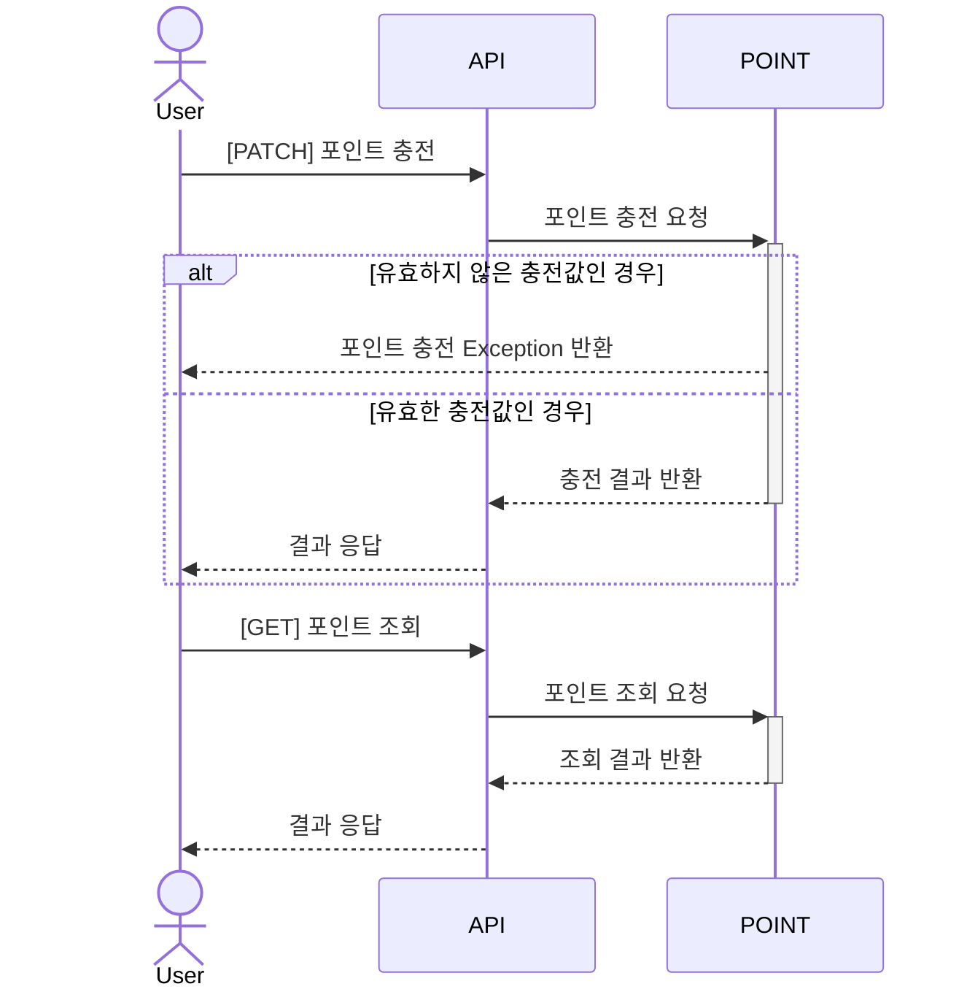
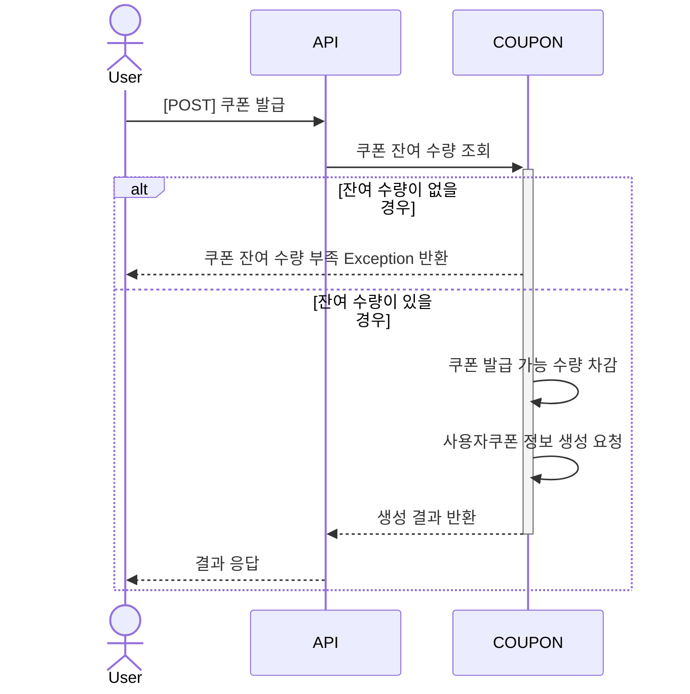
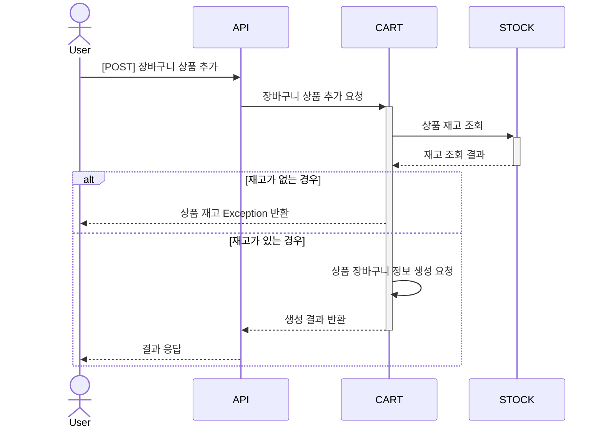
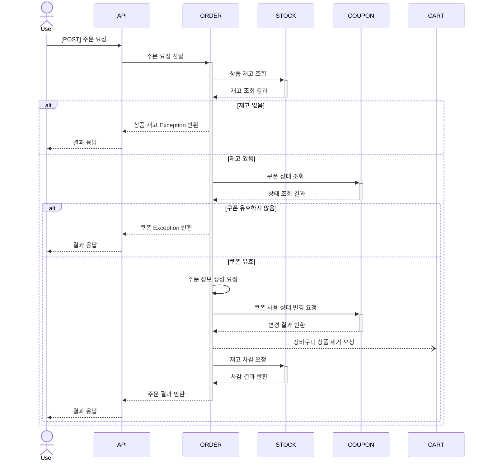
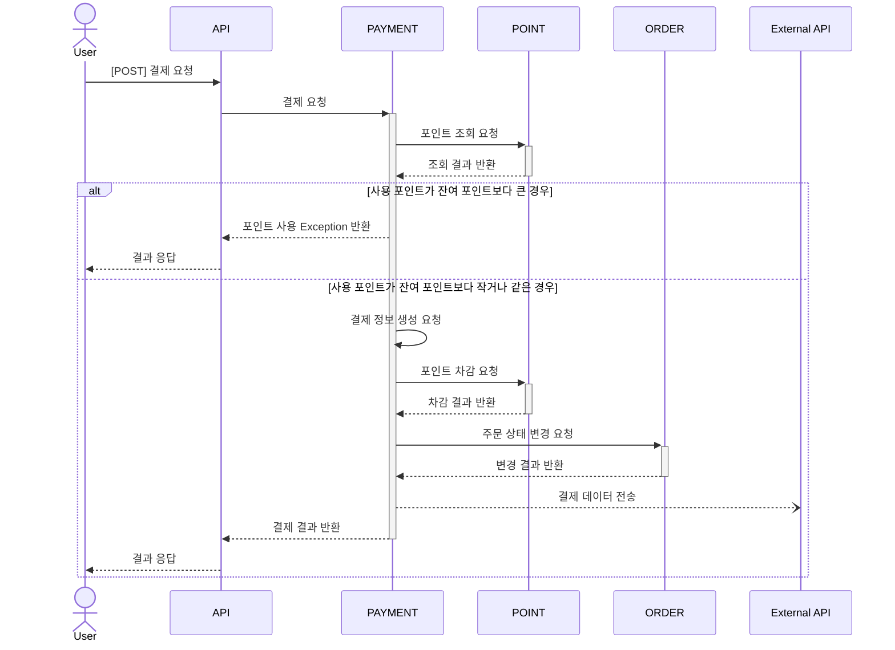
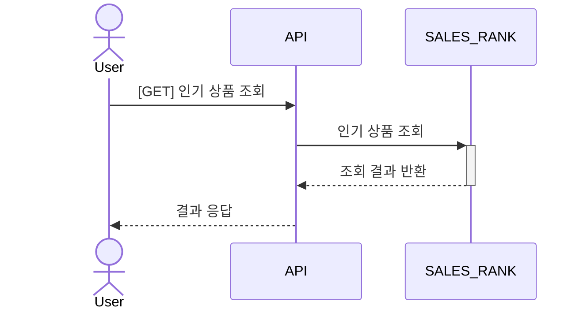

## 시퀀스 다이어그램

### 상품 조회
> 사용자가 상품 정보를 조회한다.

### 포인트 충전 / 조회
> 사용자가 결제에 사용될 포인트를 충전 및 조회한다.

### 선착순 쿠폰 발급
> 사용자가 쿠폰을 발급받는다.

### 장바구니
> 사용자가 상품을 장바구니에 추가한다.

### 주문
> 사용자가 상품을 주문한다.

재고 락 -> 분산락 걸기
멀티락 오키..

### 결제
> 사용자가 기충전된 포인트를 사용해 결제한다.

### 인기 상품 조회
> 주문 내역을 기반으로 최근 3일간 가장 많이 판매된 상위 5개 상품 목록을 조회한다.

